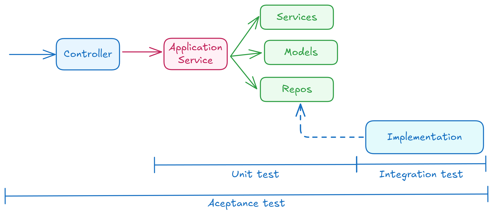

# 🧪 Tipos de Tests

---

## ✅ Tests de Aceptación

Simulan el comportamiento de un **cliente real** de la aplicación. Durante su ejecución se utilizan todas las implementaciones reales, con el fin de verificar que **todo el flujo funcional** y la **integración con la infraestructura** operan correctamente.

### 🌟 Características principales

1️⃣ **Objetivo principal:** asegurar que la aplicación funcione correctamente y que el flujo completo de las peticiones se ejecute satisfactoriamente.

2️⃣ **Velocidad de ejecución:** son las pruebas más lentas, ya que abarcan un mayor alcance e implican operaciones de entrada/salida (por ejemplo, inserciones en la base de datos) al emplear implementaciones reales de los componentes.

3️⃣ **Valor añadido:** aportan gran valor porque garantizan que todo el sistema se ejecuta de acuerdo con lo esperado.

4️⃣ **Simulación de API HTTP:** cuando se trata de una API, se simulan peticiones HTTP y se verifica que la respuesta incluya tanto el código de estado como el cuerpo esperados.

5️⃣ **Cobertura limitada:** dado que son pruebas costosas en tiempo, solo se implementa una **muestra representativa** de las distintas ramificaciones posibles de los casos de uso. Las comprobaciones más detalladas se delegan en los **tests unitarios**, evitando así el antipatrón de pruebas conocido como **“cono invertido”**.

---

## ⚙️ Tests Unitarios

Estos tests se enfocan en validar que la **lógica de negocio** de los casos de uso (capa de aplicación), así como los **modelos y servicios de dominio**, se comporten conforme a lo esperado.

### 🌟 Características principales

1️⃣ **Propósito:** verificar que la implementación de la lógica de negocio sea correcta.

2️⃣ **Rapidez:** son los tests más rápidos de ejecutar. En ellos se simulan las implementaciones de los componentes de infraestructura. Es decir, al definir un puerto en los casos de uso, se inyecta un **doble de test** para evitar operaciones reales de entrada/salida, validando únicamente la interacción con dichos componentes.

* ⚠️ Es importante **simular la interfaz de dominio** y no el cliente final, para evitar el antipatrón de infraestructura conocido como *Mocking*.

3️⃣ **Independencia del punto de entrada:** el test unitario no depende del controlador o interfaz de usuario. Dado que los casos de uso se encapsulan en servicios de aplicación reutilizables —por ejemplo, desde un **controlador HTTP-API** o una **interfaz CLI**—, el test unitario invoca directamente el caso de uso, logrando así un **desacoplamiento completo**.

4️⃣ **Cobertura detallada:** al centrarse en la lógica de negocio y ejecutarse con rapidez, incluyen las comprobaciones más exhaustivas sobre las distintas ramificaciones de los casos de uso.

---

## 🧩 Tests de integración 🔗 (capa de infraestructura)

Los **tests de integración** nos permiten comprobar de forma aislada que las distintas **implementaciones a nivel de infraestructura** —es decir, los *adapters*— funcionan correctamente.

### 🔍 Propósito

Este tipo de pruebas pueden considerarse una **variante de los tests unitarios**, con la diferencia de que el **objeto de prueba** es una **implementación concreta** de alguno de nuestros **puertos**.

### ⚙️ Comparación entre tipos de test

1️⃣ **Test unitario:**

* Sustituye la interfaz de dominio (*UserRepository*) por un **doble de prueba**.
* Evalúa el comportamiento de la lógica de negocio **sin depender de implementaciones reales**.

2️⃣ **Test de integración:**

* Evalúa la **implementación real** del componente, por ejemplo, *MySQLUserRepository*.
* Su objetivo es **verificar que el comportamiento del sistema es el esperado** cuando interactúa con infraestructuras reales (como bases de datos, APIs externas, etc.).

✅ En resumen, los tests de integración garantizan que cada *adapter* de infraestructura se comporte correctamente en un entorno real, complementando la verificación más aislada que proporcionan los tests unitarios.

## 🧩 Mapeo entre tipos de test y capas de la arquitectura

El siguiente diagrama muestra qué tipo de test cubre cada capa dentro de la **arquitectura hexagonal**:

| Tipo de Test       | Capas Cubiertas      |
| ------------------ | -------------------- |
| 🧪 **Aceptación**  | Todas las capas      |
| ⚙️ **Unitario**    | Aplicación y Dominio |
| 🔗 **Integración** | Infraestructura      |

